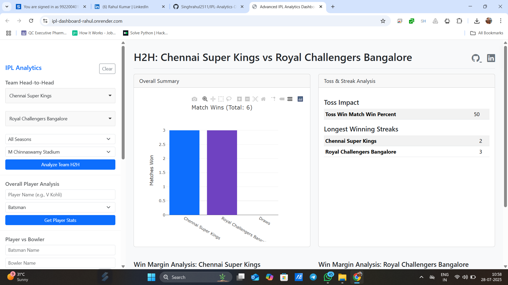
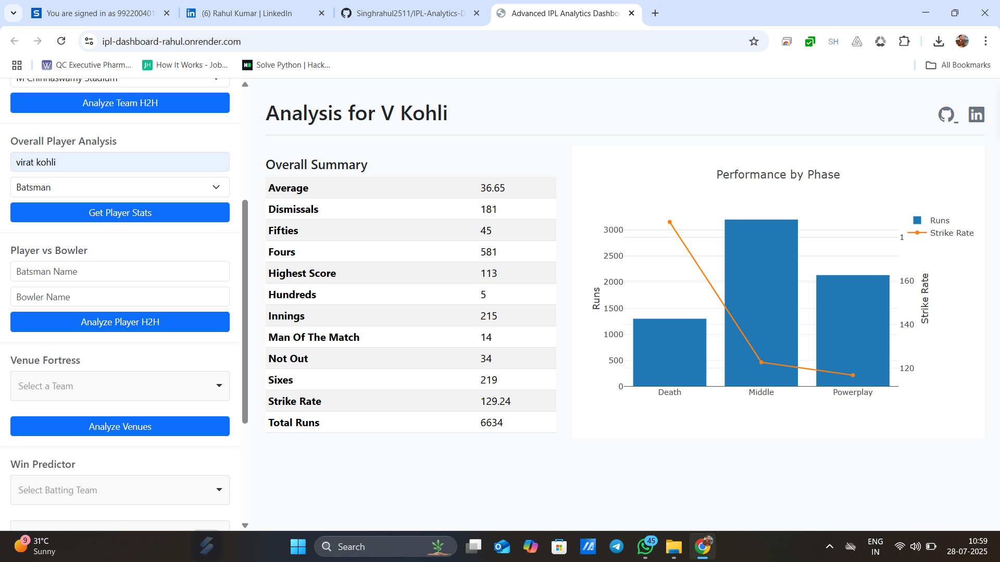
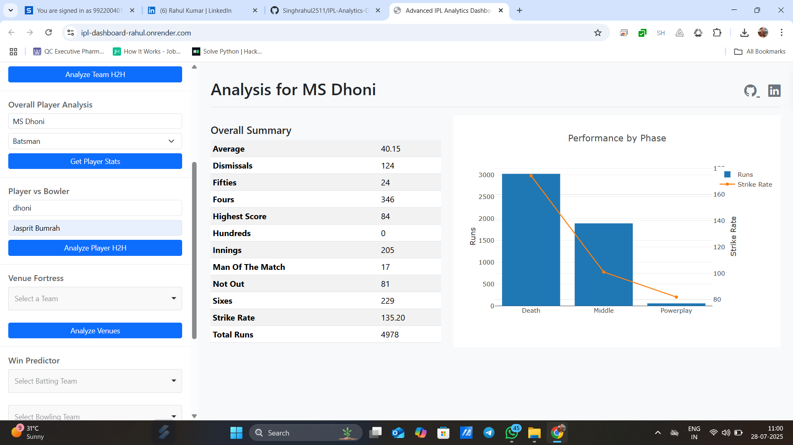
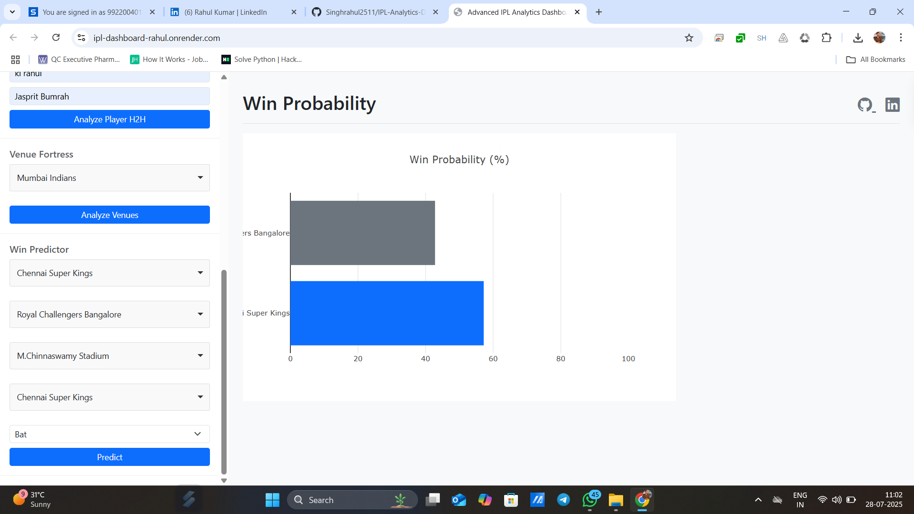

# Advanced IPL Analytics Dashboard 🏏

    

A production-ready, full-stack web application that provides deep, interactive, and data-driven insights into the Indian Premier League (IPL). This dashboard features a modular Flask backend serving a RESTful API, a dynamic Plotly.js frontend, and a lightweight machine learning model for win predictions.

---

## 🚀 Live Demo

**[https://ipl-dashboard-rahul.onrender.com/]**

---

## 🖼️ **Demo Screenshots**

### 🏏🤝Analyze Team H2H


### 📊 Get Player Statistics


### 📊 Get Player Statistics


### 🏟️📈 Analyze Venues (Winning Chances of Team in a Specific Stadium)
.png)

### 🔮⚔️ Winning Prediction of Match Between 2 Teams


---

## ✨ Key Features

### UI/UX & Interactivity
-   **Dynamic Dashboard**: Single Page Application (SPA) feel with no page reloads.
-   **Responsive Design**: A clean, modern layout that works seamlessly on desktop and mobile devices.
-   **Interactive Charts**: Powered by Plotly.js for engaging and informative visualizations.
-   **Searchable Dropdowns**: User-friendly `Choices.js` integration for easy filtering.
-   **Smart Loading**: UI shows loading spinners during API calls for a smooth user experience.

### Advanced Analytics
-   **Team Head-to-Head**: Deep dive into team matchups with filters for **Season** and **Venue**.
-   **Toss vs. Match Win Correlation**: See how often winning the toss translates to winning the match.
-   **Win Margin & Streak Analysis**: Uncover team dominance with average/max win margins and longest winning streaks.
-   **Player vs. Player**: Detailed analysis of a batsman's performance against a specific bowler.
-   **Performance by Phase**: Analyze player stats in the **Powerplay**, **Middle Overs**, and **Death Overs**.

### Machine Learning Integration
-   **Win Predictor**: A lightweight `scikit-learn` (Logistic Regression) model predicts match outcomes based on teams, venue, and toss details.
-   **Efficient Model Serving**: The pre-trained model is saved as a `.pkl` file for fast loading and low resource usage, perfect for free hosting tiers.

---

## 🔧 Tech Stack

| Layer       | Technology                                                |
| :---------- | :-------------------------------------------------------- |
| **Backend** | Python 3.12, Flask, Gunicorn                              |
| **Data/ML** | Pandas, NumPy, Scikit-learn                               |
| **Frontend**| HTML, Bootstrap 5, JavaScript (Fetch API)                 |
| **Charting**| Plotly.js                                                 |
| **Hosting** | Render                                                    |

---

## 📁 Project Structure
```bash
ipl-analytics-dashboard/
├── app.py              # Main Flask application
├── api/                # API endpoint blueprints
├── services/           # Data processing & business logic
├── static/             # CSS and other static files
├── templates/          # HTML templates
├── model/              # Trained ML model
├── data/               # Raw CSV datasets
├── cache/              # Caching directory (add to .gitignore)
├── train_model.py      # Script to train the ML model
├── requirements.txt    # Python dependencies
├── Procfile            # Deployment configuration
└── README.md           # This file

```
---

## Endpoints

| Method | Endpoint                     | Description                                    |
| :----- | :--------------------------- | :--------------------------------------------- |
| `GET`  | `/api/teams`                 | Get a list of all IPL teams.                   |
| `GET`  | `/api/venues`                | Get a list of all venues.                      |
| `GET`  | `/api/team-head-to-head`     | Get advanced H2H stats between two teams.      |
| `GET`  | `/api/player-stats`          | Get a player's overall batting/bowling stats.  |
| `GET`  | `/api/player-head-to-head`   | Get H2H stats between a batsman and a bowler.  |
| `GET`  | `/api/phase-analysis`        | Get a player's stats by innings phase.         |
| `GET`  | `/api/predict`               | Predict match outcome using the ML model.      |

---

## ⚙️ Local Setup and Installation

Follow these steps to run the project on your local machine.

1. **Clone the Repository**
        ```bash
        git clone [https://github.com/Singhrahul2511/IPL-Analytics-Dashboard-.git]
        cd ipl-analytics-dashboard
        ```
---
2. **Create and Activate a Virtual Environment**
It's highly recommended to use a virtual environment.

    ```bash

    # For Windows
    python -m venv venv
    venv\Scripts\activate

    # For macOS/Linux
    python3 -m venv venv
    source venv/bin/activate
    3. Install Dependencies
    Install all the required Python packages.

    ```
---
3. **Install dependencies**
   ```bash
   pip install -r requirements.txt
   ```
---
4. **Train the Machine Learning Model**
    This is a one-time step. Run this script to create the 
    win_predictor.pkl file in the model/ directory.
    ```bash
    python train_model.py
    5. Run the Application
    Start the Flask development server.

    ```
---
5. **Run the application**
   ```bash
   python app.py
   ```
---
4. **Open Your browser**
   ```bash
   The application will be available at http://127.0.0.1:8000.
   ```
---

## ☁️ Deployment to Render
### This project is configured for a seamless deployment on Render's free tier.

1. Host on GitHub
Create a new repository on your GitHub account.

Push your project code (including the model/win_predictor.pkl file) to this repository.

2. Deploy on Render
Sign up for a Render account.

On the dashboard, click "New +" and select "Web Service".

Connect your GitHub account and select the repository you just created.

Render will automatically detect your project. Fill in the settings:

Name: Give your service a unique name (e.g., ipl-dashboard-yourname).

Root Directory: Leave this blank if your app.py is in the root.

Runtime: Select Python 3.

Build Command: pip install -r requirements.txt (This is usually the default).

Start Command: gunicorn app:app (Render automatically detects this from your Procfile).

Click "Create Web Service". Render will pull your code, install the dependencies, and start the application. Your dashboard will be live at the URL provided by Render in a few minutes!

---

## 📜 License
